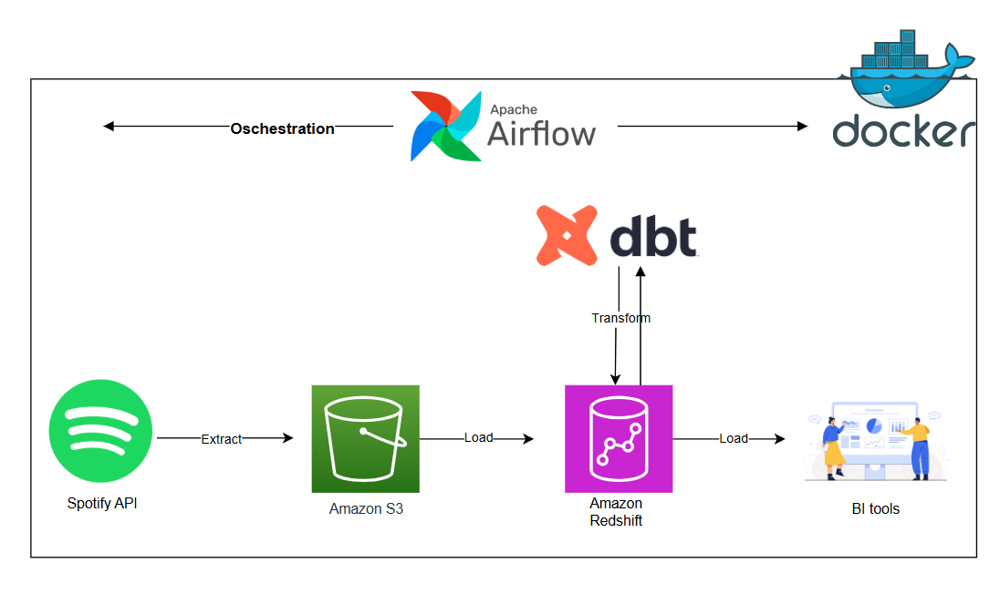

Spotify Data Pipeline with Airflow, AWS, and dbt

This project demonstrates an end-to-end ELT data pipeline for music analytics.
- It extracts category, track and artist data from the Spotify API, loads raw data into Amazon S3, ingests it into Amazon Redshift, and transforms the data into analytics-ready tables using dbt.
- The pipeline is orchestrated with Apache Airflow (Celery Executor, Docker Compose) and leverages Airflow Datasets for data-aware task dependencies.

🚀 Architecture

🛠️ Tech Stack
Orchestration: Apache Airflow (Celery Executor, Docker Compose, Airflow Datasets)
Extract: Python, Spotify API
Load: AWS S3, Redshift COPY command
Transform: dbt with dbt-redshift adapter
Infra: AWS IAM, S3, Redshift

🏆 Key Features
- Airflow Datasets for data-aware scheduling
- Scalable ingestion with S3 + Redshift COPY
- Modular transformations with dbt (staging → marts)
- Containerized with Docker for easy setup
- Configurable with environment variables and Airflow Variables

🔮 Future Improvements
- Provision AWS resources with Terraform
- Add CI/CD pipeline (GitHub Actions) for dbt tests and Python linting
- Extend Airflow with alerting & monitoring (Slack, email)
